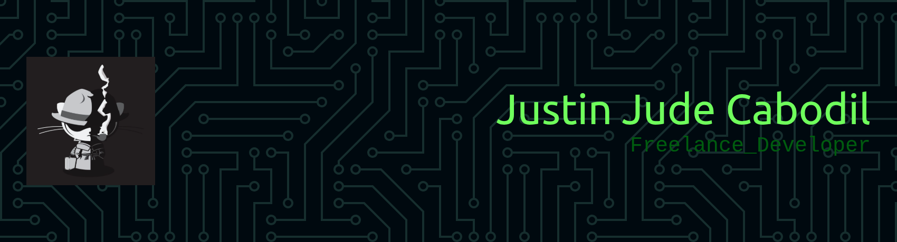

# Hello, I'm Jude Cabodil 👋

I am a Systems Engineer and Full-Stack Developer with experience in infrastructure operations, managed services, and cloud environments—primarily AWS. My background includes:

- On-premise data center troubleshooting  
- Remote server administration (Windows & Linux)  
- Full-stack and IoT application development  
- Cloud services, automation, and DevOps workflows  

I am currently expanding my expertise in **cybersecurity**, focusing on penetration testing, vulnerability assessment, and system hardening.

I am committed to delivering reliable, scalable, and secure solutions across systems engineering, software development, and technical support roles.

---

## 🔭 What I'm Currently Working On

- **Lambda Cut** – A Telegram bot for automated video content pipeline (TTS, transcription, scripting)
- **Penetration Testing** – Building hands-on skills through TryHackMe labs and CTF challenges
- **Home Lab** – Self-hosted services including Pi-hole, WireGuard VPN, and media server

---

## 📚 Currently Learning

- **Cybersecurity** – TryHackMe learning paths (Complete Beginner, Jr SOC Analyst, Red Teaming)
- **Python** – Automation scripts and security tooling
- **Docker & Kubernetes** – Container orchestration for deployment automation

---

## 💻 Projects

| Project | Description | Tech Stack |
|---------|-------------|-------------|
| [Lambda Cut](https://github.com/judecabodil22/lambda-cut) | Telegram bot for automated video content pipeline with TTS, transcription, and script generation | Python, Telegram Bot API, Google Gemini, Whisper |
| [Home Lab](https://github.com/judecabodil22/homelab) | Docker-based self-hosted services configuration | Docker, Docker Compose, Traefik, Pi-hole |

---

## 🌐 Open Source

I believe in contributing to the community. While I'm early in my open source journey, I'm:
- Exploring opportunities to contribute to security tools and automation frameworks
- Learning from mature open source projects
- Planning to release some of my automation scripts and tools

---

## 📫 Connect With Me

  
  
  

---

## 🛡️ TryHackMe Profile  

[****](https://tryhackme.com/p/Alph4r1us)

---

## 📜 Certifications

### TryHackMe Certificate – Complete Beginner Learning Path  

### Coursera – Google Cybersecurity Specialization  

---

## 🛠️ Tech Stack  

### Languages & Scripting

### Cloud & Infrastructure

### Web / App Development

### Databases

### DevOps & Tools

### Hardware & IoT

### Design

---

## 📊 GitHub Stats  

---

## 🏆 Top Contributed Repo  

---

## 📝 Random Dev Quote  

---

## 👀 Visitor Count  

